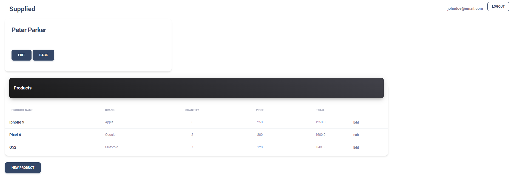

# Supplied

Made with Ruby on Rails and Bootstrap. Supplied is the perfect application to store information about your clients/suppliers and their products.

    

## Live Demo

- [Live Demo](https://cold-snow-4838.fly.dev/)

## Built With

- Ruby on Rails
- Bootstrap

## Author

**Ricardo Reiter**

- GitHub: [@ricareiter](https://github.com/ricareiter)
- Linkedin [Ricardo Reiter](https://www.linkedin.com/in/ricardoreiter/)

## 🤝 Contributing

Contributions, issues, and feature requests are welcome!

Feel free to check the [issues page](https://github.com/ricareiter/supplied/issues).

## Show your support

Give a ⭐️ if you like this project!
